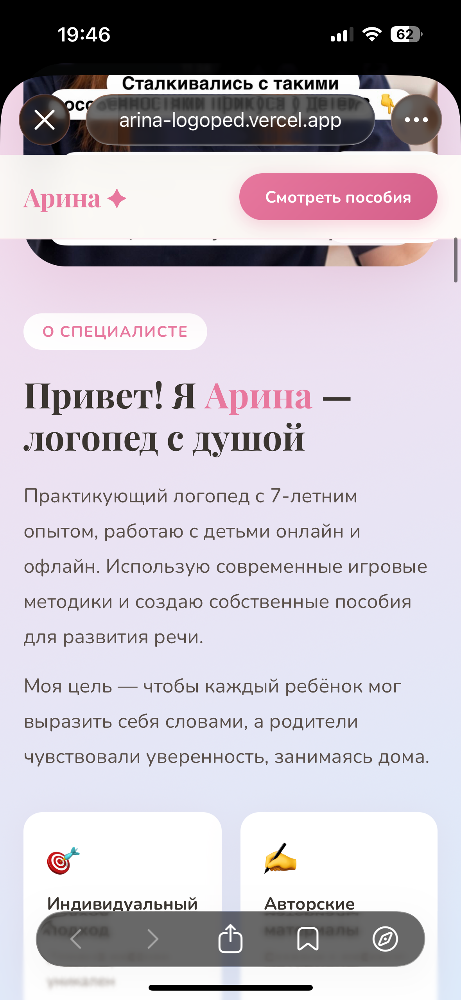
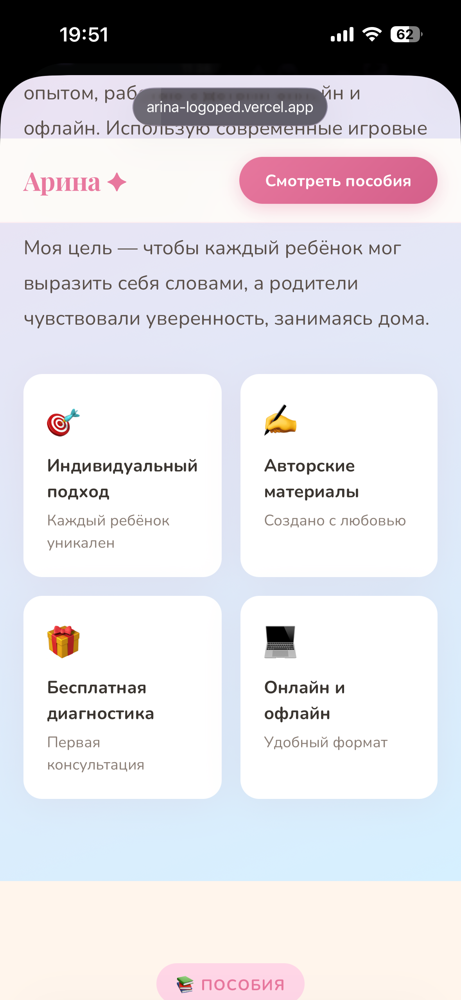
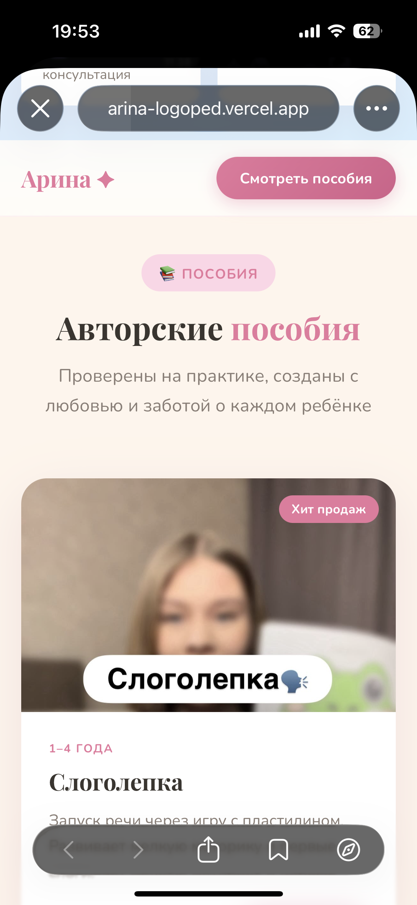
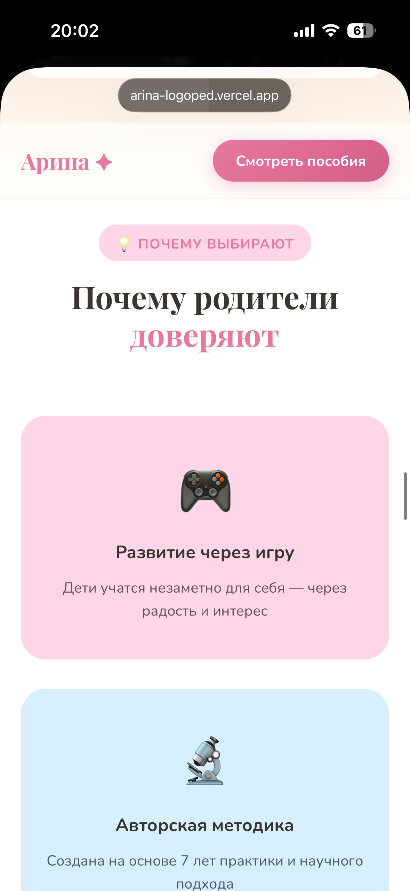
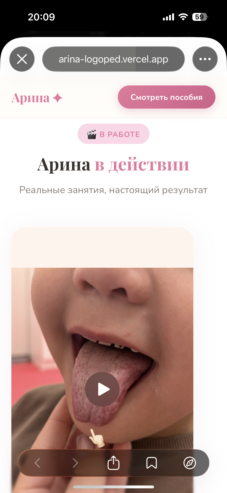
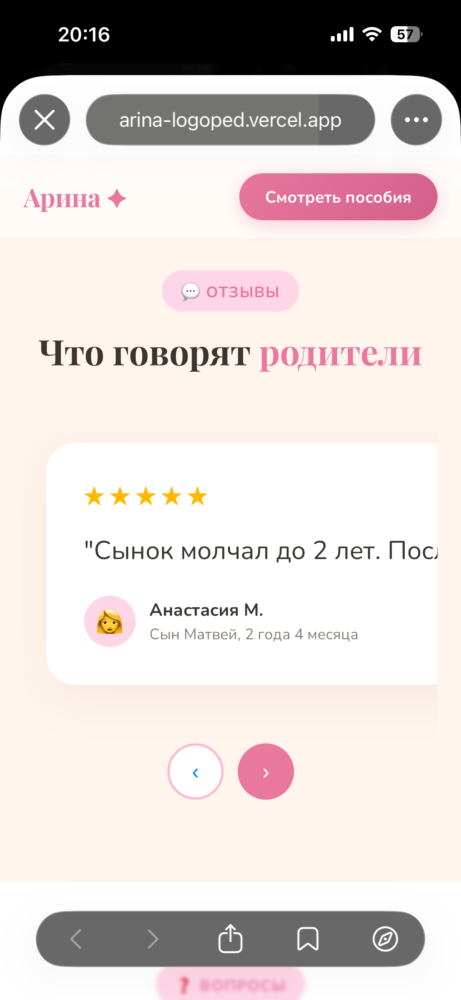
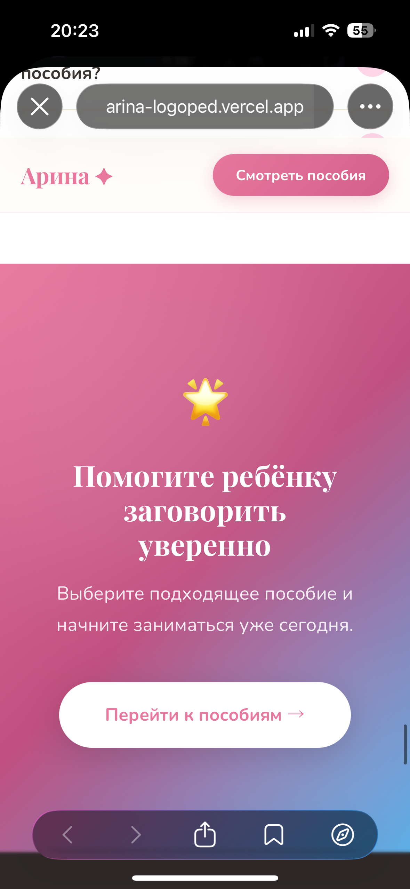
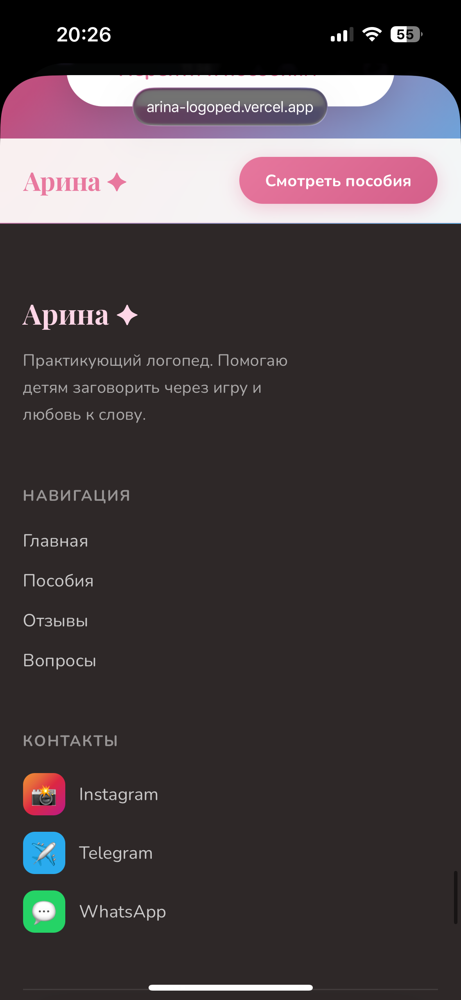

  
 ЭТА СТРАНИЦА БУДЕТ ИДТИ КАК ПЕРВАЯ   
 Привет! Я Арина — логопед. Помогаю детям запускать и развивать речь, ставлю звуки, провожу логопедический массаж. Занятия проходят в игровом формате, чтобы ребёнку было интересно и комфортно. Работаю с детьми с дислалией, дизартрией, алалией, ЗРР и ОНР, подбирая программу с учётом индивидуальных особенностей каждого ребёнка.  
  
  
  
ЭТО МЕНЯЕМ НА :  
1 фотка оставляем как есть   
2 фотка - Авторские пособие создаю на основе опыта   
3 фотка оставляем   
4 фотка оставляем   
  
  
МЕНЯЕМ ТЕКСТ   
Авторские пособия   
Проверены на практике   
Расписываем мои пособие (которые платные)   
 «Конструктор фразовой речи» стоимость  **3 500 тенге,** **550 рублей. Описание продукта- **помогает запустить речь ребёнка: от звукоподражаний к словам и фразам. Пособие формирует навык просьбы, расширяет словарный запас и учит ребёнка самостоятельно строить фразы по готовым моделям.  
  
**«Слоговая ритмика» **3 000 тенге, 500 рублей. Описание продукта - пособие для развития слоговой структуры слова, чувства ритма речи, слухового внимания и навыка переключения.  
  
  
  
1 фото оставляем и текст тоже   
2 фото -     📈 **Реальные результаты у детей** — родители видят прогресс уже в процессе занятий.  
3 фото-     🤝 **Работа в команде с семьёй**  
    Родители понимают цели каждого занятия и участвуют в процессе.  
  
Меняем все видео 👇🏻  
  
  
  
  
  
  
  
  
  
  
  
  
  
  
  
  
  
  
  
Отзывы меняем полностью . ФОТО ОТЗЫВА ПУСТЬ БУДУТ БОЛЬШИМИ   
  
1- Спасибо большое Арине! Ребёнок с удовольствием ходил на занятия, а результат не заставил себя ждать. Речь стала намного чище и увереннее. Очень рекомендую!  
2- Огромное спасибо Арине! Мы пришли на запуск речи, когда ребёнок почти не говорил. Уже через несколько месяцев появились первые слова, а затем и фразы. Занятия всегда интересные, а результат превзошёл все наши ожидания!  
3- Сначала переживали, что онлайн будет неэффективно, но уже после первых занятий все сомнения исчезли. Ребёнок с удовольствием занимается, а результаты заметны с каждым месяцем. Спасибо большое!  
4- Купили пособие у вас и сразу начали заниматься дома. Всё очень понятно, удобно и интересно для ребёнка. Уже появились новые слова и первые фразы. Спасибо за такой полезный материал!  
  
  
  
ЧАСТЫЕ ВОПРОСЫ УБЕРЕМ   
  
  
  
  
  
МЕНЯЕМ ТЕКСТ НА   
  
**    Начните путь к речи уже сегодня.** Помогу сделать этот путь понятным, эффективным и интересным для ребёнка.  
  
  
  
  
  
  
Меняем   
Арина - практикующий логопед.  
  
По навигации убрать вопросы   
